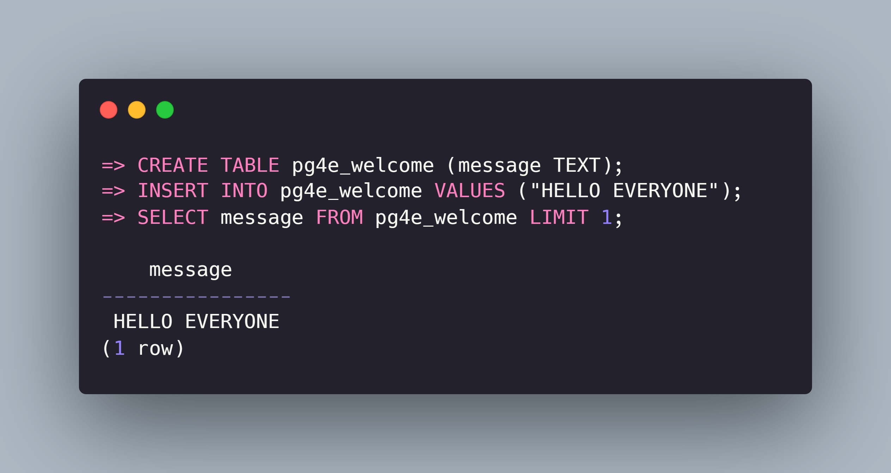

# Postgres For Everybody Notes, Solutions

## Content

- This repository contains the notes I've written and assignment solutions I've done for the [pg4e](https://www.pg4e.com/) course by Dr. Charles Severance.
- The structure of the files is a bit different from the structure of the course itself, but it's still in order so it won't be hard to follow along.
- I encourage you to take a look at the [written resources](https://www.pg4e.com/lectures/) Dr. Chuck has written as well.
- There are:
  - markdown lecture notes.
  - assignment sql & python solutions.
  - some other sql problem solutions I found on youtube for extra practice.
