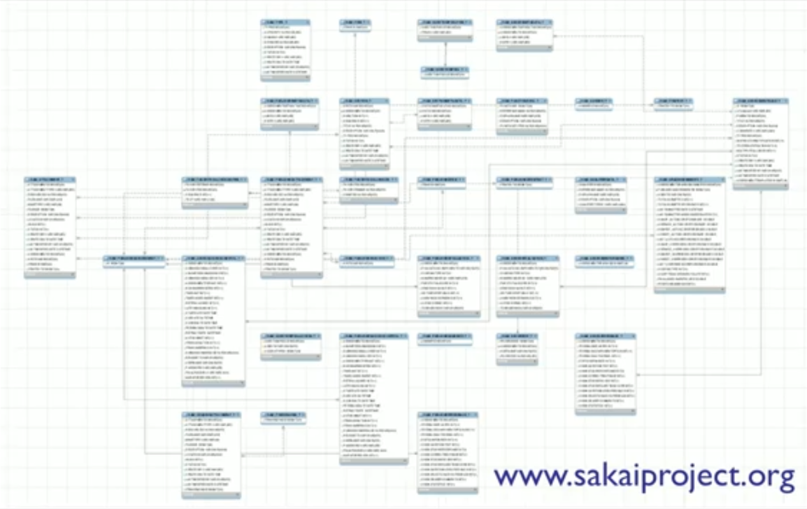
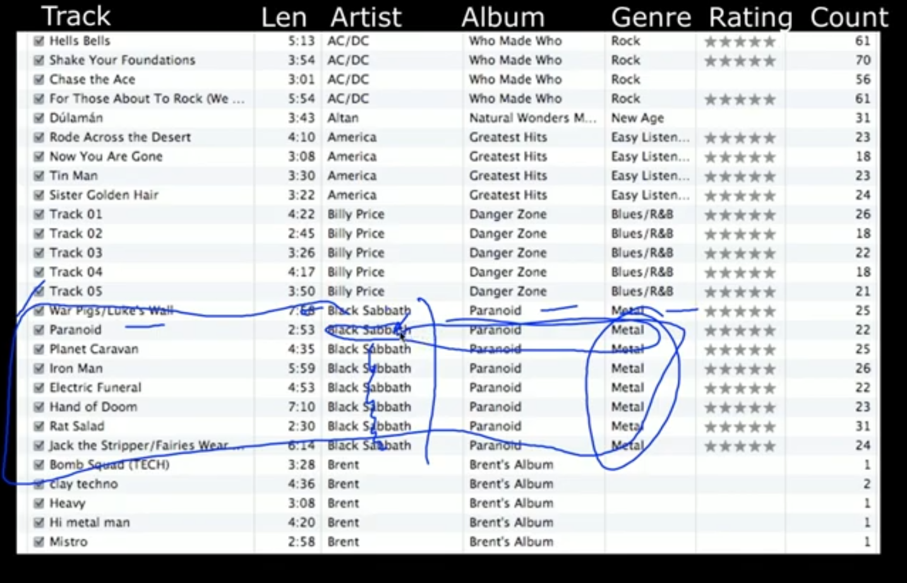
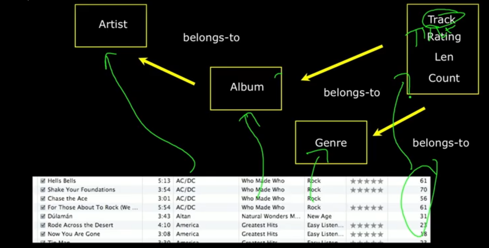

# DATABASE DESIGN

- start with drawing
- **DON'T VERTICALLY REPLICATE STRING DATA, USE A RELATIONSHIP**
- one thing irl means only 1 column of it in the db.

---

## Example database

- it's ok to have int replication, no need for a separate table.
- string ones tho...

