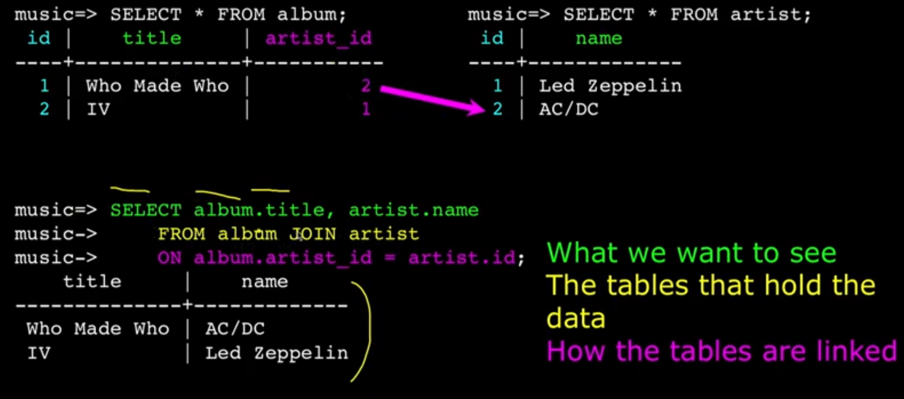

# JOINS

## Inner Join

- links across multiple tables using the FKs by using the ON clause.
- it filters where the PKs & FKs match.
- it's like a JOIN with a WHERE clause
- you can use `INNER JOIN` or just `JOIN`



```sql
SELECT -- specifying which columns we want
  album.title as album,
  artist.name as artist
FROM album JOIN artist
ON album.artist_id = artist.id; -- making sense of the FK
```

- It can get complex:

```sql
SELECT
  track.title,
  artist.name
FROM
  track,
  album
  JOIN artist ON album.artist_id = artist.id;
```

```sql
SELECT (
  track.title,
  artist.name,
  album.title,
  genre.name
  )
FROM
  track
  JOIN genre ON track.genre_id = genre.id
  JOIN album ON track.album_id = album.id
  JOIN artist ON album.artist_id = artist.id;
```

---

## Cross Join

- no need for ON clause
- takes all combinations (the PKs/FKs that match and don't match)
- not so efficient, but sometimes needed

```sql
SELECT track.title, track.genre_id, genre.id, genre.name
FROM track CROSS JOIN genre;
```

---

## ON DELETE Choices

- (Default) RESTRICT -> doesn't allow you to delete.
- CASCADE -> delete all the rows connected.
- SET NULL -> sets the connected fields on the rows to null.
