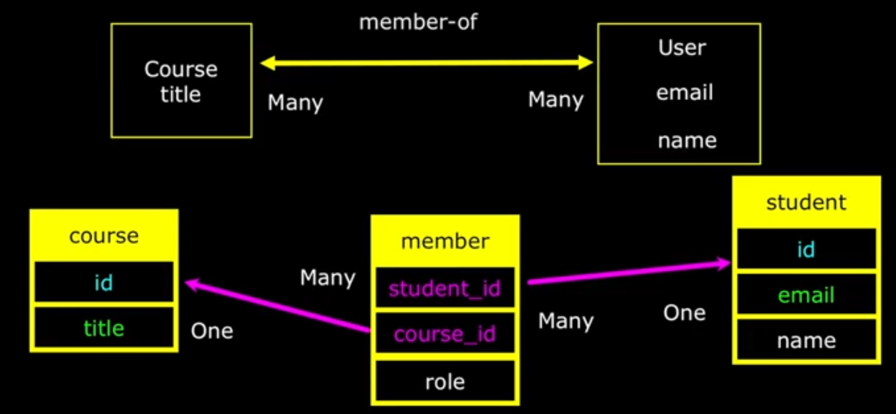

# MANY TO MANY RELATIONSHIPS

## Why

- you add a junction table containing FKs to both tables


---

## Student-Member-Course



- add member junction-table containing FKs to students and courses
- the combination of the FKs is a compound PK to the table
- you can add extra info on the membership like a role column

```sql
CREATE TABLE student(
  id SERIAL,
  name VARCHAR(128),
  email VARCHAR(128) UNIQUE, -- logical key
  PRIMARY KEY(id)
);

CREATE TABLE course(
  id SERIAL,
  title VARCHAR(128) UNIQUE, -- logical key
  PRIMARY KEY(id)
);

CREATE TABLE member(
  student_id INTEGER REFERENCES student(id) ON DELETE CASCADE,
  course_id INTEGER REFERENCES course(id) ON DELETE CASCADE,
  role INTEGER, -- u only have 2 roles, if more just make a new table
  PRIMARY KEY(student_id, course_id)
);
```

SELECTION:

```sql
SELECT
  student.name as "name",
  member.role as "role",
  student.email as "email",
  course.title as "course"
FROM
  member
  JOIN student ON member.student_id = student.id
  JOIN course ON member.course_id = course.id
WHERE
  role = 1
ORDER BY
  course.title DESC,
  student.name;
```
