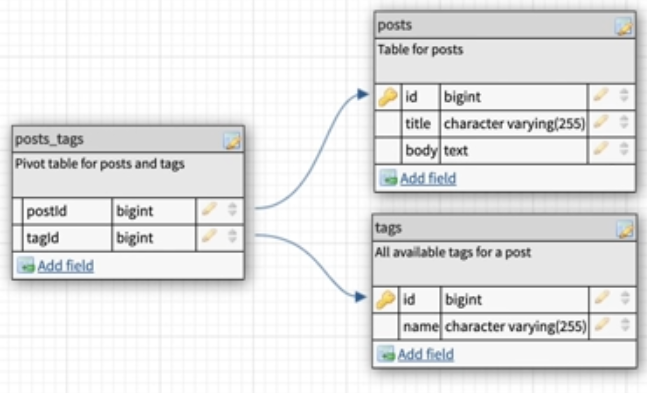

# BEN AWAD SUB QUERY PROBLEM

## Statement

- You have a m2m relationship between **posts** & **tags**
  

- Given a tag, you want to retrieve its posts, and retrieve all the tags those posts have

---

## Solutions

1. You want to get the tags connected to posts, then the posts connected to it, and filter based on tag

```sql
select p.title, t.name
from posts p
  inner join posts_tags pt
    on p.id=pt."postId"
  inner join tags t
    on t.id=pt."tagId"
where t.name='javascript';
```

### Solution 1 - Sub Queries

2. You want to fetch the ids of the posts corresponding to a tag from a query.

3. And in the other query, you get the tags corresponding to those posts.

```sql
-- first query, getting the post ids
select p.id from posts p
inner join posts_tags pt on pt."postId"=p.id
inner join tags t on pt."tagId"=t.id
where t.name='javascript';
-- Gets us 1,2,3,4
```

```sql
-- second query, getting their tags
select distinct p.title, t.name
from posts p
inner join posts_tags pt on pt."postId"=p.id
inner join tags t on pt."tagId"=t.id
where p.id in (1,2,3,5)
order by p.title, t.name;
```

4. Combine them

```sql
select p.title as post, t.name as tag
from posts p
inner join posts_tags pt on pt."postId"=p.id
inner join tags t on pt."tagId"=t.id
where p.id in (
  select pt."postId" from posts_tags pt
  inner join posts p on pt."postId"=p.id
  inner join tags t on pt."tagId"=t.id
  where t.name='javascript'
)
order by p.title, t.name;
```

---

### Solution 2 - GROUP BY

- no need for 2 queries

```sql
select p.*, string_agg(distinct t.name, ', ') as tags
-- p.* means all p columns
-- string_agg joins the text rows into 1 row, like the python join
from posts p
  inner join posts_tags pt on pt."postId"=p.id
  inner join tags t on pt."tagId"=t.id
group by p.id -- most important one, you can only select aggr funcs or the clmns specified by group by
having string_agg(t.name, '|') ilike '%javascript%'; -- t.name = 'javascript' wouldn't work cuz it's not in the group by
```

Solution:
```
 id |       title       | body  |             tags
----+-------------------+-------+------------------------------
  1 | hello world       | stuff | java, javascript, typescript
  2 | code splitting    | stuff | javascript, typescript
  3 | react hello world | stuff | java, javascript
  5 | vue tutorial      | stuff | java, javascript
```