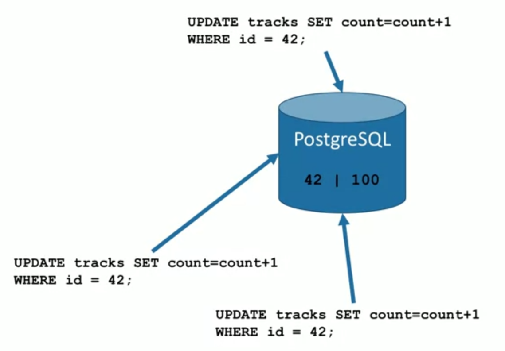

# CONCURRENCY



- You have multiple statements coming from multiple sources at the same time, how do you handle that? They can't all go in at the same time.
- When this happens, the db locks a statement and forces the others to wait in a queue.

## Compound statements

- two statements inside one

```sql
insert into ...
returning *;
```

---

## ON CONFLICT / DO

- basically a try/catch in sql
- when a constraint prevents you from doing something, do smth else
- **MUCH** better than using 2 sql statements and using conditionals

```sql
insert into fav (post_id,account_id,howmuch)
  values (1,1,1)
on conflict(post_id,account_id) -- if there's already a row
  do update set howmuch=fav.howmuch+1 -- do this
returning *;
```

## Transactions

```sql
begin; -- begins (transaction) storing the statements, don't execute now
select howmuch from fav where acc_id=1 and post_id=1
  FOR UPDATE OF fav -- lock this statement from updating after a period of time
rollback; -- cancel the transaction statements
...
commit; -- commit to db
```
